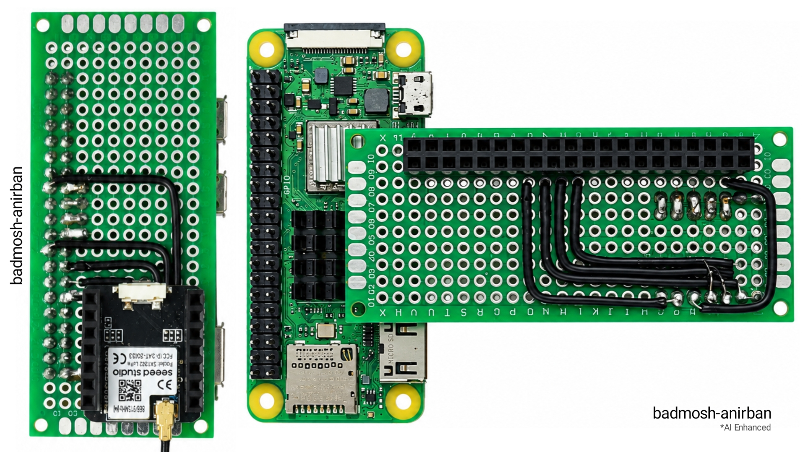
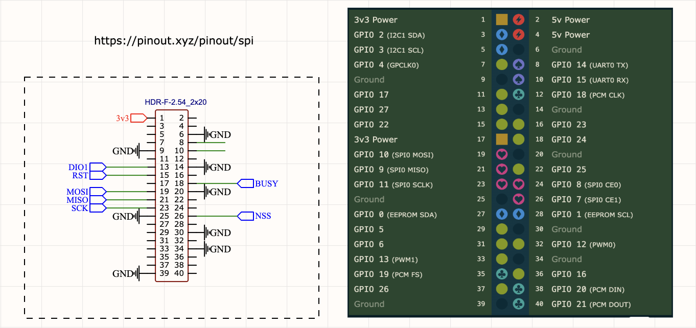

# pyradiolib

Python bindings for the [**RadioLib C++ library**](https://github.com/jgromes/RadioLib) targeting **SX1262 LoRa modules** on **Raspberry Pi**, utilizing RadioLib's official `PiHal` and Linux `lgpio`.



---

## 1. Architecture

```text
Python Application (your script or daemon)
        │
        ▼
    pyradiolib  (Python module)
        │
  pybind11 layer  (bindings.cpp)
        │
        ▼
  SX1262Wrapper  (C++ wrapper)
        │
        ▼
  RadioLib C++ (SX1262 / Module)
        │
        ▼
   PiHal (RPi HAL)
        │
        ▼
      lgpio
        │
   ┌────┴────────┐
   ▼             ▼
Linux SPI    Linux GPIO
   │             │
   └─────┬───────┘
         ▼
    SX1262 LoRa
```

Key principles:

- **No Python rewrite** of radio protocols or register logic — wraps tested RadioLib C++ directly.
- **Hardware abstraction** through RadioLib's official `PiHal.h`([my version](hal/PiHal.h) is slightly modified) using `lgpio`.
- **GIL released** during transmission and packet reception so Python asyncio, threads, and UI don't block.
- **`gpiozero` coexistence**: SX1262 pins are owned by `PiHal`, leaving other GPIO pins completely free for `gpiozero` without driver conflict.

---

## 2. Hardware Wiring (Defaults)

| Pin Function | SX1262 Pin | Raspberry Pi Pin (BCM)       | Description              |
| :----------- | :--------- | :--------------------------- | :----------------------- |
| **MOSI**     | MOSI       | GPIO 10 (SPI0 MOSI)          | SPI Data to Radio        |
| **MISO**     | MISO       | GPIO 9 (SPI0 MISO)           | SPI Data from Radio      |
| **SCK**      | SCK        | GPIO 11 (SPI0 SCLK)          | SPI Clock                |
| **NSS / CS** | NSS        | GPIO 7 (CE1) or GPIO 8 (CE0) | Chip Select (Default: 7) |
| **DIO1**     | DIO1       | GPIO 27                      | Interrupt / Packet Ready |
| **RESET**    | NRST       | GPIO 22                      | Hardware Reset           |
| **BUSY**     | BUSY       | GPIO 24                      | Radio Busy Line          |
| **Power**    | 3.3V       | 3.3V Pin                     | Power supply             |
| **Ground**   | GND        | GND Pin                      | Ground                   |

_All pin assignments are completely configurable when creating the `SX1262` object._

I'm using a **Raspberry Pi zero 2W** & [Wio-SX1262 for XIAO](https://www.seeedstudio.com/Wio-SX1262-for-XIAO-p-6379.html) (not sponsored, not affiliated)



## 3. Raspberry Pi Prerequisites

### Step 1: Enable SPI

Open the Raspberry Pi configuration tool:

```bash
sudo raspi-config
```

Navigate to **Interface Options** -> **SPI** -> **Yes** to enable SPI, then finish.

### Step 2: Install required Dependencies

```bash
sudo apt update
sudo apt install -y liblgpio-dev python3-dev python3-pip python3-gpiozero
```

### Step 3: Create virtual environment and install the library

```bash
python3 -m venv .venv --system-site-packages
source ./venv/bin/activate

pip install --no-cache-dir pyradiolib
```

_If you wish to build from the source follow this guide: [building&publishing.md](building&publishing.md)_

## 4. Python Quick Start

### Basic Transmitter (TX)

```python
from pyradiolib import SX1262, ERR_NONE

# 1. Initialize radio with pin mapping
radio = SX1262(
    spi_channel=1,      # SPI CE1
    spi_speed=2000000,  # 2 MHz
    nss=7,              # NSS pin
    dio1=27,            # DIO1 pin
    reset=22,           # RESET pin
    busy=24             # BUSY pin
)

# 2. Begin LoRa operation
status = radio.begin(
    frequency=866.5,    # MHz
    bandwidth=125.0,    # kHz
    spreading_factor=7, # SF7
    coding_rate=5,      # 4/5
    power=10            # 10 dBm
)

if status != ERR_NONE:
    print(f"Init error: {radio.get_status_text()}")
    exit(1)

# 3. Transmit packet (accepts string or bytes)
status = radio.transmit("Hello from Raspberry Pi LoRa!")
if status == ERR_NONE:
    print("Transmitted successfully!")
```

### Basic Receiver (RX)

```python
from pyradiolib import SX1262, ERR_NONE

radio = SX1262(spi_channel=1, nss=7, dio1=27, reset=22, busy=24)
radio.begin(frequency=866.5, bandwidth=125.0, spreading_factor=7, coding_rate=5, power=10)

print("Listening for packets...")
while True:
    # Wait up to 5 seconds for a packet (releases GIL while waiting)
    packet = radio.receive(timeout_ms=5000)

    if packet:
        print(f"Received {len(packet)} bytes:")
        print(f"  Payload: {packet.text}")
        print(f"  RSSI:    {packet.rssi:.1f} dBm")
        print(f"  SNR:     {packet.snr:.1f} dB")
```

### Context Manager Usage

```python
with SX1262(spi_channel=1, nss=7, dio1=27, reset=22, busy=24) as radio:
    radio.begin(frequency=866.5)
    radio.transmit("Self-closing radio session")
# Radio, SPI, and GPIO handles are automatically released here
```

---

## 5. Examples

The `examples/` directory contains complete runnable examples:

| Script                                                         | Purpose                                                                    |
| :------------------------------------------------------------- | :------------------------------------------------------------------------- |
| [`examples/native_test.cpp`](examples/native_test.cpp)         | Native C++ hardware verification executable                                |
| [`examples/basic_tx.py`](examples/basic_tx.py)                 | Blocking LoRa transmitter                                                  |
| [`examples/basic_rx.py`](examples/basic_rx.py)                 | Blocking LoRa receiver                                                     |
| [`examples/interrupt_tx.py`](examples/interrupt_tx.py)         | **Non-blocking / Interrupt transmitter** (`start_transmit`, callbacks)     |
| [`examples/interrupt_rx.py`](examples/interrupt_rx.py)         | **Non-blocking / Interrupt receiver** (continuous listen, callbacks)       |
| [`examples/change_settings.py`](examples/change_settings.py)   | **Runtime settings demo** (frequency, BW, SF, sync word, power, CRC, TCXO) |
| [`examples/basic_tx_rx.py`](examples/basic_tx_rx.py)           | Interactive CLI tool with configurable RF parameters                       |
| [`examples/gpiozero_coexist.py`](examples/gpiozero_coexist.py) | Demonstrates coexistence with `gpiozero` peripherals                       |

### Running the examples:

Make sure you are running the following examples after activating your virtual environment.

From the repository root (make sure `pyradiolib` is installed or in `PYTHONPATH`, for the respective virtual environment):

```bash
# If running directly after building(by cmake & make) in build/:
export PYTHONPATH=$PYTHONPATH:$(pwd)/build

# Run blocking TX:
python3 examples/basic_tx.py

# Run blocking RX:
python3 examples/basic_rx.py


# Run non-blocking interrupt TX:
python3 examples/interrupt_tx.py

# Run non-blocking interrupt RX (continuous mode, no timeouts):
python3 examples/interrupt_rx.py


# Run runtime settings demo:
python3 examples/change_settings.py

# Run with gpiozero:
python3 examples/gpiozero_coexist.py
```

---

## 6. Python API Reference

### `SX1262` Class

#### Constructor:

```python
SX1262(
    spi_channel: int = 1,
    spi_speed: int = 2000000,
    spi_device: int = 0,
    gpio_device: int = 0,
    nss: int = 7,
    dio1: int = 27,
    reset: int = 22,
    busy: int = 24
)
```

#### Methods:

##### 1. Modem Initialization:

- `begin(frequency=866.5, bandwidth=125.0, spreading_factor=7, coding_rate=5, sync_word=0x12, power=10, preamble_length=8, tcxo_voltage=1.6, use_regulator_ldo=False) -> int`: Initializes LoRa modem. Returns `0` on success.

##### 2. Blocking TX / RX:

- `transmit(data: Union[str, bytes]) -> int`: Transmits packet (blocking until TX finishes). Releases GIL. Returns `0` on success.
- `receive(timeout_ms: int = 0, return_none_on_error: bool = True) -> Optional[Packet]`: Receives packet (blocking with timeout). Releases GIL.

##### 3. Non-Blocking / Interrupt TX / RX:

- `start_transmit(data: Union[str, bytes]) -> int`: Initiates packet transmission asynchronously.
- `finish_transmit() -> int`: Cleans up transmitter and powers down RF switch after transmission.
- `start_receive(timeout_ms: int = 0) -> int`: Puts radio into continuous listening mode (`0` = no timeout).
- `read_data(return_none_on_error: bool = True) -> Optional[Packet]`: Reads received packet data from the buffer.
- `set_packet_received_action(callback: Callable[[], None]) -> None`: Registers a Python callback invoked when a packet arrives.
- `clear_packet_received_action() -> None`: Unregisters the packet received callback.
- `set_packet_sent_action(callback: Callable[[], None]) -> None`: Registers a Python callback invoked when transmission completes.
- `clear_packet_sent_action() -> None`: Unregisters the packet sent callback.
- `radio.has_received`: Property returning `True` if a packet was received via interrupt.
- `radio.has_sent`: Property returning `True` if transmission finished via interrupt.
- `clear_flags() -> None`: Resets the interrupt status flags.

##### 4. Runtime RF & Modem Settings:

- `set_frequency(freq: float) -> int`: Sets carrier frequency in MHz.
- `set_bandwidth(bw: float) -> int`: Sets bandwidth in kHz (125.0, 250.0, 500.0, etc.).
- `set_spreading_factor(sf: int) -> int`: Sets spreading factor (5 to 12).
- `set_coding_rate(cr: int) -> int`: Sets coding rate denominator (5 to 8).
- `set_output_power(power: int) -> int`: Sets transmission power in dBm (-9 to +22).
- `set_sync_word(sync_word: int, control_bits: int = 0x44) -> int`: Sets LoRa sync word (e.g. `0x12` private, `0x34` public).
- `set_current_limit(current_limit: float) -> int`: Sets over-current protection in mA (45 - 240 mA; 0 to disable).
- `set_preamble_length(preamble_length: int) -> int`: Sets preamble length in symbols (0 to 65535).
- `set_crc(enable: bool) -> int`: Enables (`True`) or disables (`False`) CRC checksum.
- `set_tcxo(voltage: float, delay: int = 5000) -> int`: Sets TCXO reference voltage (1.6 - 3.3V, or 0.0 for XTAL).
- `set_dio2_as_rf_switch(enable: bool = True) -> int`: Configures DIO2 to control RF switch automatically.

##### 5. Power & Mode Management:

- `standby(mode: int = 1) -> int`: Enters standby mode (`1` = STDBY_RC, `2` = STDBY_XOSC).
- `sleep(retain_config: bool = False) -> int`: Enters low power sleep mode.
- `set_frequency(freq: float) -> int`: Sets carrier frequency in MHz.
- `set_bandwidth(bw: float) -> int`: Sets bandwidth in kHz.
- `set_spreading_factor(sf: int) -> int`: Sets spreading factor (5 to 12).
- `set_coding_rate(cr: int) -> int`: Sets coding rate denominator (5 to 8).
- `set_output_power(power: int) -> int`: Sets transmission power in dBm (-9 to +22).
- `get_rssi() -> float` / `radio.rssi`: RSSI of the last received packet.
- `get_snr() -> float` / `radio.snr`: SNR of the last received packet.
- `get_status_text() -> str`: Human-readable error description for `last_status`.
- `close() -> None`: Releases SPI and GPIO resources.

### `Packet` Class

Returned by `radio.receive()`:

- `packet.payload` / `packet.data`: Raw bytes of payload.
- `packet.text`: Payload decoded as UTF-8 string.
- `packet.rssi`: Signal strength in dBm.
- `packet.snr`: Signal to noise ratio in dB.
- `packet.status`: Integer status code (`0` = success).
- `len(packet)`: Payload length in bytes.
- `bool(packet)`: Evaluates to `True` if `status == 0`.

---

## 7. Common Error Codes & Troubleshooting

| Code   | Name                  | Cause & Solution                                                                                                                               |
| :----- | :-------------------- | :--------------------------------------------------------------------------------------------------------------------------------------------- |
| `0`    | `ERR_NONE`            | Operation succeeded.                                                                                                                           |
| `-2`   | `ERR_CHIP_NOT_FOUND`  | Radio chip not responding over SPI. Verify SPI is enabled (`raspi-config`), check NSS/CE pin connection, SPI channel (0 vs 1), and 3.3V power. |
| `-5`   | `ERR_TX_TIMEOUT`      | Transmission timed out. Check DIO1 and BUSY pin wiring.                                                                                        |
| `-6`   | `ERR_RX_TIMEOUT`      | No packet received within timeout period.                                                                                                      |
| `-7`   | `ERR_CRC_MISMATCH`    | Packet corrupted during transmission. Check antennas and frequency/SF alignment.                                                               |
| `-706` | `ERR_SPI_CMD_TIMEOUT` | SX1262 command timed out. If your board uses a crystal (XTAL) rather than TCXO, set `tcxo_voltage=0.0`.                                        |
| `-707` | `ERR_SPI_CMD_INVALID` | Invalid SX1262 command. Check TCXO voltage or chip revision.                                                                                   |

---

# Other

### Project Architecture & Layout

```
├── .gitignore
├── .gitmodules
├── building&publishing.md      # Building from source & publishing details
├── CMakeLists.txt              # Unified build system (native C++ & Python module)
├── LICENSE
├── MANIFEST.in                 # Required by PyPI
├── pyproject.toml              # Modern Python packaging configuration
├── README.md                   # Full documentation, wiring guide, and API reference
├── setup.py                    # pip install . support with CMakeExtension
│
├── hal/
│   └── PiHal.h                 # Official RadioLib lgpio HAL with my modifiactions
│
├── src/
│   ├── sx1262_wrapper.h        # C++ wrapper header & Packet definition
│   ├── sx1262_wrapper.cpp      # C++ wrapper implementation (RadioLib + PiHal)
│   └── bindings.cpp            # pybind11 module bindings with GIL release
│
├── examples/
│   ├── basic_tx.py             # Continuous blocking transmitter
│   ├── basic_rx.py             # Continuous blocking receiver
│   ├── interrupt_tx.py         # Non-blocking / Interrupt transmitter
│   ├── interrupt_rx.py         # Non-blocking / Interrupt receiver
│   ├── basic_tx_rx.py          # Interactive CLI tool with configurable RF parameters
│   ├── gpiozero_coexist.py     # gpiozero coexistence demo
│   ├── change_settings.py      # Runtime settings demo
│   └── native_test.cpp         # Standalone C++ hardware verification
│
├── others/                     # Ignore this, not a part of the project
│
├── media/                      # Images, videos, etc.
│
├── agents/                     # AI skill
│
└── RadioLib/                   # RadioLib C++ submodule
```

---

### Key Highlights of the Implementation

1. **Direct C++ Binding (No Protocol Reimplementation)**:

   - Uses the existing, tested [`RadioLib`](RadioLib) C++ library and [`hal/PiHal.h`](hal/PiHal.h) (`lgpio`).
   - Radio registers, LoRa packet framing, and interrupt handling remain in native C++.

2. **Pythonic API (`pyradiolib`)**:

   - Constructor allows complete configuration of SPI (`spi_channel=1, spi_speed=2000000`) and GPIO pins (`nss=7, dio1=17, reset=22, busy=24`).
   - `begin()` defaults to your prototype settings: **866.5 MHz**, **125.0 kHz BW**, **SF7**, **CR 4/5**, **10 dBm**.
   - `transmit()` seamlessly accepts both Python `str` and binary `bytes`.
   - `receive(timeout_ms=5000)` returns a `Packet` object (`packet.payload`, `packet.text`, `packet.rssi`, `packet.snr`) or `None` on timeout.
   - Supports Python context managers: `with SX1262(...) as radio:`.

3. **GIL Release & `gpiozero` Coexistence**:

   - `transmit()` and `receive()` release the Python GIL (`py::call_guard<py::gil_scoped_release>()`) during radio operations so background threads, asyncio, and `gpiozero` event handlers run without blocking.
   - SX1262 pins are owned by `PiHal` while other pins remain free for `gpiozero` (demonstrated in [`examples/gpiozero_coexist.py`](examples/gpiozero_coexist.py)).

4. **Multi-Stage Verification Support**:
   - Includes [`examples/native_test.cpp`](examples/native_test.cpp) to verify native C++ SPI communication on the Pi before testing Python.

---
